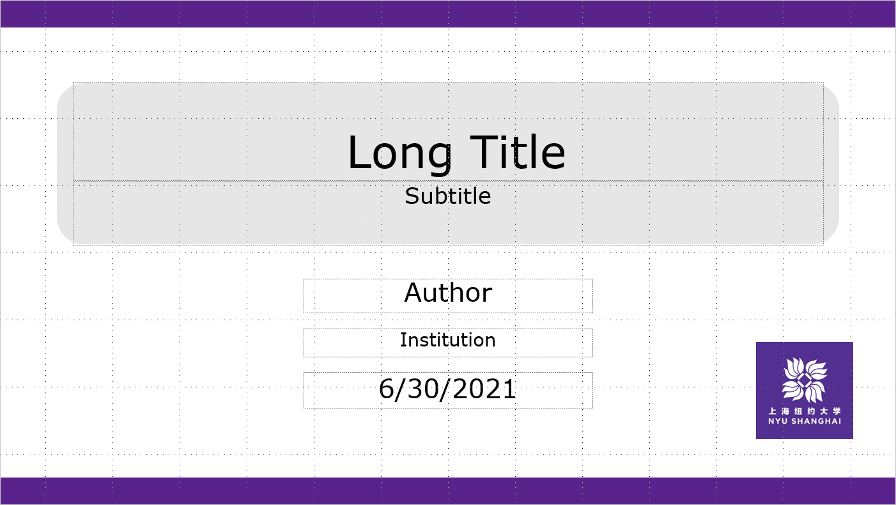

# NYU Shanghai PPT Template (not official)
  
  
This is my attempt to convert the official [New York University SHANGHAI (NYU SHANGHAI) presentation template](https://www.overleaf.com/latex/templates/new-york-university-shanghai-nyu-shanghai-presentation-template/xyjndrnkqbzm) from Latex into PPT. 

- Note: this PPT template is *not NYUSH-official*. For exmaple, it uses the Verdana font, not the font from the official Latex template.  
- However, my version offers *accessibility imporvements* in terms of color contrast, text margins, and text size. 

Feedback welcome. Open issues. 
